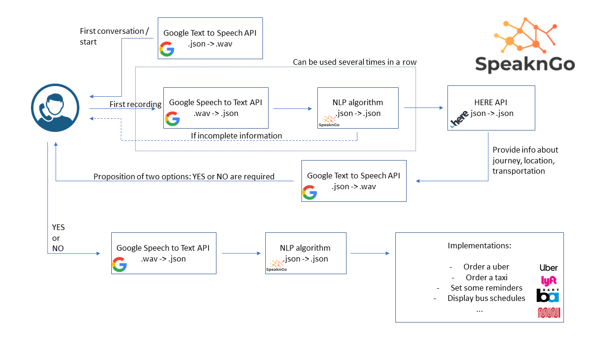

## SpeaknGo
2019 - Project for Hackmobility 2019, merging the issues of Inclusion, Mobility and Artificial Intelligence 
<p align="center"> </p>

## Abstract 

*"Many communities have ample transportation services for their elderly and residents with disabilities who don’t drive, but those services are often too difficult to find, according to a new national survey.*

*Eighty percent of people with a disability and 40 percent of older adults who don’t drive said they couldn’t do all the activities and errands they needed or wanted to do because they couldn’t get around, according to the survey of about 1,650 people by KRC Research for the National Aging and Disability Transportation Center.*

*Many said it had left them feeling frustrated, isolated, trapped and dependent on others."*
The Washington Post

**SpeaknGo** is a project building upon this observation. Our vision is to makes transportation easy and affordable for everyone and to remove the mobility barriers that still left people isolated. To do so, we have created a service based on **Speech Recognition** and **Natural Language Processing**. The service is taking a vocal request from the user, that want to go to a place at a given time. It analyses this request and extract location and date information. Those information are used to find the desired place on the map and determine the optimal transportation option for the user (that is adapted to his personal constraints - disability or mobility difficulties). Then, it propose the best options to the user that can easily confirm the trip. In case the trip has been scheduled in advance, a reminder is set. This project especially leverages the **Here API**. 

Two UI have been created: a smartphone widget to easily request the ride and have all the information stored on the phone and a number to call to make the request for users that does not have a smartphone. 

### Equitable 

*How can we make transportation more accessible to everyone in society?*

Through this project, our main targets are the **elderly** and the **people with disabilities**. Both face barriers when it come to do activities that necessitate to travel. Some people are *not used to* the new applications that gives access to modern transportation (Uber, City Mapper...). Some *cannot use* the traditional tools to make reservations or choose a service, because of a disability, such as blind people. The main issue with those situations is the *diffulty of using the UI* of traditional services. 

Our solution tackle this issue by providing the simplest interface. The user only have to make a voice request to his phone. This request is then analysed and all the research process is handled by the application. The user has then just to confirm which option is good for him, and the reservation is done by the application. 

In addition, in order to **include the broadest possible population**, *two user interfaces* are created. One for smartphone owner, and the other, available to any person that have a phone. This last very simple UI only consists of calling a number and making the vocal request.
## Speech to text

This module provide the knowledge to do the conversion Speech-To-Text with the use of the **API of Google Speech**.

Use ```STT_run.py``` to provide the audio file you want to convert. 
The output will be a dictionnary of all the words.

We displayed a drawing of the words over a timeline to be able to evaluate the success of the service. 


## Natural Language Processing


Using the text generated in a json format, a NLP **Named Entity Recognition** model is used to extract relevant information out of the request. The function get_information returns a dictionary with two keys: location and date. 

Query to extract location and date information form a json file:

```python
python nlp.py -r request.json
```

## Determination of the best ride

We are using HERE's API (https://developer.here.com/) to query possible mobility options, along with their details such as the mode or services, total time needed, departure time associated, and cost. We can then select a limited few that would be relevant to the user, and suggest those options to the user.

Once the model has determined the best options, it **proposes the three best** to users that can **make a choice**, based on different criterion (*mode of transportation*, *price* or *duration*). Then, the request is stored in the **database** with the addresse, date and time. A couple of time before the ride, SpeaknGo gives a **reminder to the user** and confirm the reservation. The user has then just to go to its destinations.

The users can do **two different kind of requests**:
- A *specific address* that is extracted with the NLP model and the best solutions to get there is calculated
- A *point of interest*, such as a supermarket or the gym. In that case, the model look for closest options and displays them in its propositions. The users has then just to decide its prefered option.

## Pipeline Structure

 

## Service

Two UI are designed, the first one for users that are using smartphones. This one is based on an Android interactive widget.


Yet, as some users, especially among the elderly, might not use smartphones on a daily basis, a simpler UI is also designed. This only consists in calling a number on any usable phone.


## Example of App service

 


