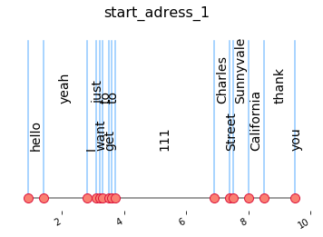
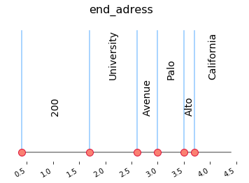

# SpeaknGo - Speech-to-text Service

This module provide the knowledge to do the conversion Speech-To-Text with the use of the API of Google Speech.

## Files usage

Use STT_run.py to provide the audio file you want to convert. 
The output will be a dictionnary of all the words.

## Example

We displayed a drawing of the words over a timeline to be able to evaluate the success of the service. 

